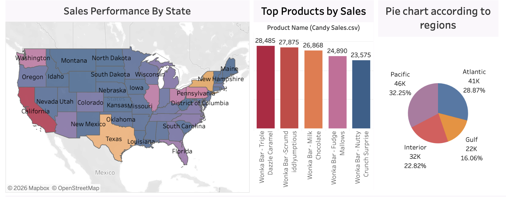
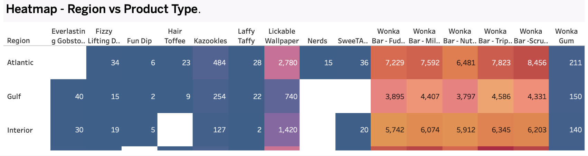

# Sweets-Sales-Distribution

## Overview
The Sweets Distribution Dashboard is a comprehensive data visualization project designed to analyze the sales, distribution, and overall performance of various candy products across multiple regions and factories. By integrating advanced analytics with an intuitive interface, this dashboard provides deep insights into the confectionary business, enabling data-driven decision-making.

## Key Features
- **Sales and Revenue Tracking:** Monitor overall sales performance, monthly trends, and product-specific revenue generation.
- **Regional and Divisional Analysis:** Break down sales data by geographical regions (e.g., Atlantic) and specific divisions to identify high-performing areas and opportunities for growth.
- **Product Insights:** Detailed look at individual candy products, including popular items like SweeTARTS, Laffy Taffy, Nerds, and various Wonka Bar variations.
- **Advanced Sentiment Analysis with R:** The project utilizes R for performing sentiment analysis on customer feedback or related textual data, providing an extra layer of qualitative insight.
- **R Integration for Chart Plotting:** R scripts are seamlessly integrated into the analytical pipeline to generate complex, customized charts that go beyond standard visualization capabilities.
- **Tableau Integration:** The dashboard leverages the power of Tableau for interactive and dynamic visualizations, connecting directly with R through RServe to process and visualize advanced statistical and sentiment data in real-time.

## Insights and Visualizations
The dashboard includes several key visualizations to help users interpret the data:

1. **Monthly Sales Trends**
   Provides a month-over-month breakdown of sales, highlighting seasonal peaks and variations.
   

2. **Sales Variability**
   Analyzes the standard deviation in sales across different products and regions, giving insights into market stability.
   

3. **Regional Performance**
   A geographical view of sales distribution, illustrating which regions are leading in revenue.
   

## Technology Stack
- **Tableau:** Primary visualization and dashboarding tool.
- **R:** Used for advanced statistical analysis, sentiment analysis, and custom chart plotting.
- **RServe:** Facilitates the integration between Tableau and R, allowing Tableau to send data to R and receive computed results and plots dynamically.

## Getting Started
To view and interact with the dashboard:
1. Ensure you have Tableau Desktop or Tableau Reader installed.
2. If R integration features are required to run locally, ensure R and the `Rserve` package are installed and running.
3. Open the `Sweets Distribution Dashboard.twbx` file in Tableau.

*(Note: Please add the actual chart screenshots to the `images/` directory to replace the placeholders.)*
